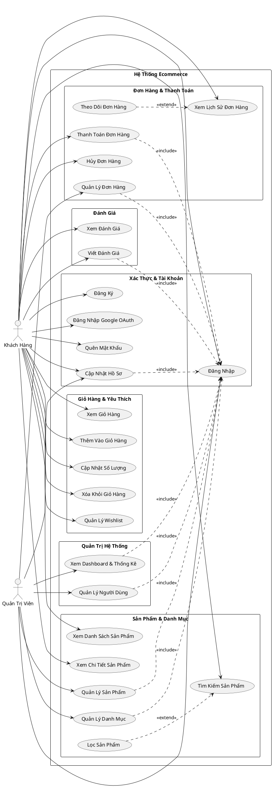
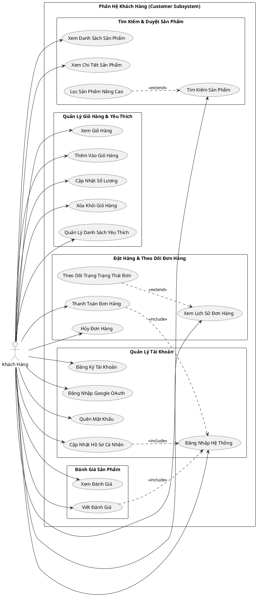
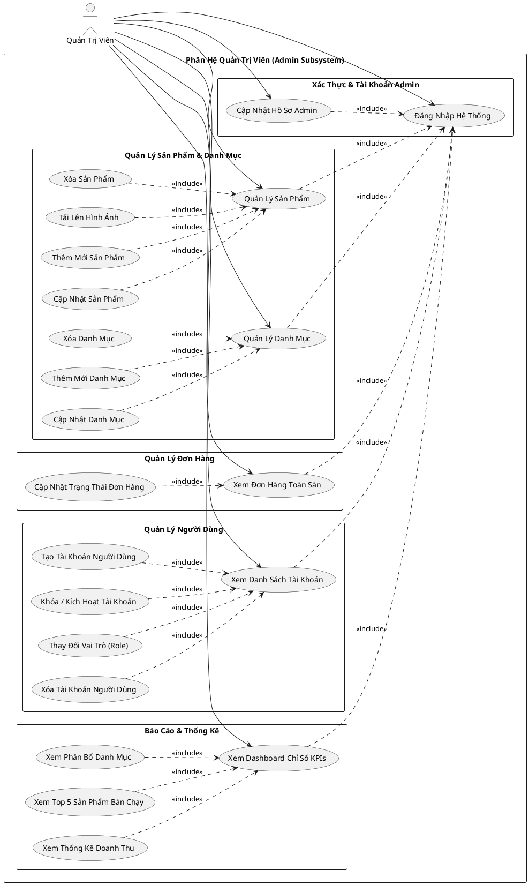
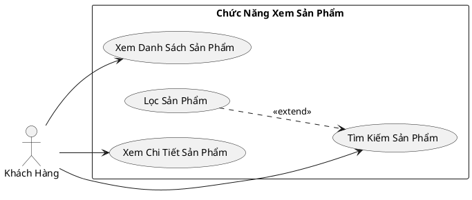
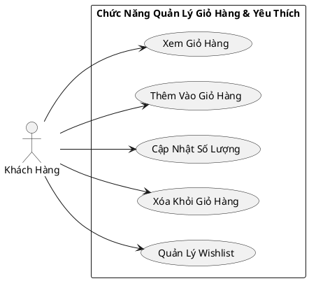
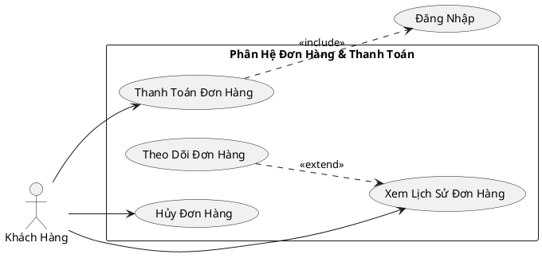
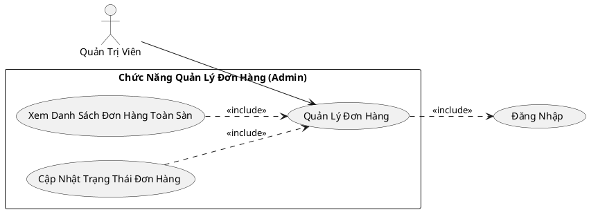

# CHƯƠNG 4: THIẾT KẾ HỆ THỐNG

## 4.1 Phân tích và mô tả hệ thống

### 4.1.1 Chức năng đối với khách hàng (Customer)

Hệ thống thương mại điện tử cung cấp cho khách hàng một quy trình trải nghiệm mua sắm khép kín từ khâu tìm kiếm sản phẩm đến thanh toán và theo dõi đơn hàng. Các chức năng cụ thể bao gồm:

#### 1. Quản lý tài khoản và xác thực (Authentication & Profile Management)
* **Đăng ký tài khoản:** Khách hàng có thể đăng ký tài khoản mới bằng cách cung cấp các thông tin cần thiết như Email, Mật khẩu, Số điện thoại, Họ và Tên. Hệ thống thực hiện mã hóa mật khẩu bằng thuật toán bcrypt trước khi lưu trữ vào cơ sở dữ liệu.
* **Đăng nhập hệ thống:** Hỗ trợ đăng nhập bằng tài khoản đã đăng ký hoặc đăng nhập nhanh thông qua bên thứ ba (Google OAuth).
* **Quản lý mật khẩu:**
  * **Đổi mật khẩu:** Khách hàng có thể thay đổi mật khẩu hiện tại trong phần cài đặt bảo mật để tăng tính an toàn cho tài khoản.
  * **Khôi phục mật khẩu (Quên mật khẩu):** Khách hàng yêu cầu khôi phục mật khẩu thông qua địa chỉ Email. Hệ thống sẽ tạo một Token bảo mật có thời hạn và gửi liên kết đặt lại mật khẩu về Email của khách hàng thông qua giao thức SMTP.
* **Quản lý hồ sơ cá nhân:** Cho phép khách hàng xem và chỉnh sửa thông tin cá nhân bao gồm: Ảnh đại diện (Avatar), Họ và Tên, Số điện thoại, và Địa chỉ giao hàng mặc định.

#### 2. Duyệt và tìm kiếm sản phẩm (Product Browsing & Searching)
* **Duyệt sản phẩm theo danh mục:** Sản phẩm được phân loại theo các danh mục rõ ràng (ví dụ: Thiết bị tính toán - Computing, Điện tử, thời trang...). Khách hàng có thể dễ dàng lọc xem sản phẩm theo từng danh mục cụ thể.
* **Tìm kiếm sản phẩm:** Khách hàng nhập từ khóa tìm kiếm trên thanh công cụ tìm kiếm (Search bar). Hệ thống sử dụng cơ chế xử lý debounce để tối ưu hóa tần suất gọi API, trả về kết quả khớp với tên hoặc mô tả sản phẩm.
* **Bộ lọc sản phẩm nâng cao:** Cho phép người dùng lọc sản phẩm theo các tiêu chí:
  * Khoảng giá (Giá tối thiểu - Min Price đến Giá tối đa - Max Price).
  * Lọc theo danh mục (Category).
* **Sắp xếp sản phẩm (Sorting):** Khách hàng có thể sắp xếp danh sách sản phẩm theo:
  * Sản phẩm mới nhất.
  * Giá từ thấp đến cao (Giá: Thấp → Cao).
  * Giá từ cao đến thấp (Giá: Cao → Thấp).
  * Tên sản phẩm từ A → Z và ngược lại từ Z → A.
* **Phân trang sản phẩm (Pagination):** Hiển thị sản phẩm theo số lượng cấu hình sẵn trên mỗi trang (ví dụ: 9 sản phẩm/trang) để tối ưu thời gian tải trang và trải nghiệm người dùng.

#### 3. Xem chi tiết sản phẩm (Product Detail)
* **Xem thông tin chi tiết:** Hiển thị đầy đủ thông tin về sản phẩm bao gồm Tên sản phẩm, Thương hiệu, Mô tả chi tiết, Giá bán, Trạng thái kho hàng (Còn hàng/Hết hàng).
* **Bộ sưu tập hình ảnh (Product Gallery):** Xem nhiều hình ảnh chi tiết của sản phẩm. Hệ thống tự động phân biệt ảnh chính (Primary Image) và các ảnh phụ để hiển thị lên khung ảnh lớn và danh sách ảnh thu nhỏ phía dưới.
* **Đánh giá và phản hồi (Reviews):** Xem điểm số đánh giá trung bình (số sao) và các lượt đánh giá chi tiết từ những khách hàng đã mua sản phẩm.
* **Chọn số lượng:** Tùy chỉnh số lượng sản phẩm trước khi thêm vào giỏ hàng hoặc danh sách yêu thích.

#### 4. Quản lý giỏ hàng (Cart Management)
* **Giỏ hàng khách vãng lai (Guest Cart):** Khách hàng chưa đăng nhập vẫn có thể thêm sản phẩm vào giỏ hàng. Thông tin giỏ hàng được lưu tạm thời tại bộ nhớ trình duyệt (`localStorage`).
* **Đồng bộ hóa giỏ hàng (Cart Synchronization):** Ngay sau khi khách hàng đăng nhập thành công, hệ thống tự động đồng bộ hóa danh sách sản phẩm trong giỏ hàng tạm thời (`localStorage`) lên cơ sở dữ liệu MongoDB của server để lưu trữ vĩnh viễn.
* **Các thao tác trên giỏ hàng:**
  * Thêm sản phẩm vào giỏ hàng trực tiếp từ trang danh mục hoặc trang chi tiết.
  * Tăng/giảm số lượng của từng sản phẩm trong giỏ hàng.
  * Xóa sản phẩm khỏi giỏ hàng.
  * Hiển thị bảng tóm tắt giỏ hàng: Tổng số lượng mặt hàng, Tổng số tiền tạm tính, thông tin quy đổi tỷ giá.
  * Hiển thị thông báo (Toast notifications) trực quan sau mỗi hành động thêm/sửa/xóa thành công.

#### 5. Danh sách yêu thích (Wishlist)
* **Lưu sản phẩm yêu thích:** Cho phép khách hàng lưu trữ các sản phẩm quan tâm vào danh sách yêu thích để dễ dàng theo dõi và mua lại sau.
* **Các thao tác trên danh sách yêu thích:**
  * Thêm/Xóa sản phẩm khỏi danh sách yêu thích nhanh chóng bằng biểu tượng trái tim.
  * Chuyển nhanh sản phẩm từ danh sách yêu thích vào giỏ hàng.

#### 6. Quy trình thanh toán đơn hàng (Checkout Process)
* **Cung cấp thông tin giao hàng:** Khách hàng điền thông tin người nhận bao gồm: Họ tên, Số điện thoại liên hệ, và Địa chỉ nhận hàng chi tiết.
* **Phương thức thanh toán phong phú:** Hỗ trợ nhiều hình thức thanh toán đa dạng:
  * **Thanh toán khi nhận hàng (COD - Cash on Delivery):** Khách hàng nhận hàng rồi mới thanh toán tiền mặt cho nhân viên giao hàng.
  * **Thanh toán chuyển khoản tự động qua cổng SePay:** Hệ thống tích hợp dịch vụ SePay để tạo mã QR động chứa đầy đủ thông tin: số tài khoản nhận, tên ngân hàng MBBank, chủ tài khoản, số tiền cần trả (tự động quy đổi USD sang VND theo tỷ giá cấu hình sẵn, ví dụ: 1 USD = 25,000 VND), và nội dung chuyển khoản được sinh tự động theo mã đơn hàng. Khách hàng chỉ cần quét mã QR để thanh toán nhanh mà không cần nhập thủ công thông tin chuyển khoản.
  * **Thanh toán chuyển khoản ngân hàng thông thường (Bank Transfer).**
  * **Thanh toán qua thẻ tín dụng (Credit Card).**
* **Xác nhận đặt hàng:** Sau khi đặt hàng thành công, giỏ hàng hiện tại sẽ được làm sạch (clear) và hệ thống chuyển hướng khách hàng tới trang xác nhận đơn hàng thành công hoặc hiển thị mã QR chuyển khoản ngân hàng nếu chọn phương thức quét mã QR.

#### 7. Quản lý đơn hàng và Lịch sử mua hàng (Order & Purchase History)
* **Theo dõi trạng thái đơn hàng:** Xem danh sách toàn bộ các đơn hàng đã đặt kèm trạng thái xử lý hiện tại (ví dụ: Chờ xác nhận, Đang xử lý, Đang giao, Đã giao hàng, Đã hủy).
* **Xem chi tiết đơn hàng:** Xem lại thông tin chi tiết của một đơn hàng cụ thể bao gồm danh sách các mặt hàng đã mua, đơn giá, số lượng, phương thức thanh toán đã chọn, địa chỉ giao hàng và tổng chi phí cuối cùng.

### 4.1.2 Chức năng đối với quản trị viên (Admin)

Hệ thống quản trị cung cấp cho quản trị viên các công cụ mạnh mẽ để giám sát, phân tích tình hình kinh doanh, quản lý dữ liệu cốt lõi (sản phẩm, danh mục, người dùng) và vận hành quy trình bán hàng. Các chức năng cụ thể bao gồm:

#### 1. Báo cáo thống kê và Phân tích doanh thu (Dashboard & Business Analytics)
* **Giám sát chỉ số vận hành tổng quan:** Theo dõi nhanh các chỉ số đo lường hiệu quả hoạt động chính (KPIs):
  * Tổng số khách hàng đăng ký trên hệ thống.
  * Số lượng khách hàng đang hoạt động (Active Users).
  * Tổng số lượng sản phẩm đang kinh doanh.
  * Tổng số lượng đơn đặt hàng và số lượng đơn hàng đã giao thành công.
* **Báo cáo doanh thu:** Tính toán tổng doanh thu thực tế của hệ thống (loại trừ các đơn hàng ở trạng thái đã hủy) và giá trị trung bình trên mỗi đơn hàng (Average Order Value).
* **Thống kê doanh số theo thời gian:** Hiển thị biểu đồ phân tích doanh thu và số lượng đơn hàng chi tiết theo từng tháng để nắm bắt xu hướng phát triển.
* **Thống kê theo danh mục:** Biểu diễn tỷ trọng doanh số bán ra và số lượng sản phẩm tiêu thụ phân bổ theo từng danh mục sản phẩm khác nhau.
* **Top sản phẩm bán chạy:** Liệt kê danh sách 5 sản phẩm có sản lượng bán ra cao nhất kèm doanh thu chi tiết của từng sản phẩm.

#### 2. Quản lý sản phẩm (Product Management)
* **Xem danh sách sản phẩm:** Tra cứu toàn bộ danh sách sản phẩm trong hệ thống với các thông tin về giá, số lượng tồn kho, danh mục và hình ảnh.
* **Thêm mới sản phẩm:** Nhập các thuộc tính của sản phẩm mới bao gồm: Tên sản phẩm, Thương hiệu, Mô tả, Giá bán, Số lượng tồn kho, Danh mục phân loại và tải lên hình ảnh sản phẩm.
* **Cập nhật sản phẩm:** Chỉnh sửa thông tin chi tiết của các sản phẩm hiện có (ví dụ: cập nhật giá bán khi có chương trình khuyến mãi hoặc thay đổi số lượng tồn kho thực tế).
* **Xóa sản phẩm:** Xóa vĩnh viễn sản phẩm khỏi hệ thống cơ sở dữ liệu.
* **Tải lên hình ảnh sản phẩm (Upload Images):** Hỗ trợ công cụ upload hình ảnh thông qua thư viện `multer`. Hình ảnh tải lên sẽ được kiểm tra định dạng (.jpeg, .jpg, .png, .webp, .gif) và kích thước giới hạn (tối đa 5MB) trước khi được lưu trữ vật lý trên server và cập nhật đường dẫn ảnh.

#### 3. Quản lý danh mục (Category Management)
* **Xem danh sách danh mục:** Tra cứu toàn bộ danh mục sản phẩm hiện có kèm theo thống kê số lượng sản phẩm thực tế thuộc về từng danh mục.
* **Thêm mới danh mục:** Tạo các danh mục mới để phân loại sản phẩm.
* **Cập nhật danh mục:** Chỉnh sửa tên danh mục hoặc các thông tin liên quan.
* **Xóa danh mục:** Gỡ bỏ các danh mục không còn sử dụng khỏi hệ thống.

#### 4. Quản lý đơn hàng (Order Management)
* **Xem danh sách đơn hàng toàn hệ thống:** Quản trị viên có quyền truy cập vào danh sách tất cả các đơn đặt hàng từ mọi khách hàng trên hệ thống, sắp xếp theo thời gian đặt hàng mới nhất.
* **Xem chi tiết đơn hàng:** Xem chi tiết thông tin người mua, danh sách sản phẩm, số lượng, đơn giá, tổng tiền thanh toán, địa chỉ nhận hàng và phương thức thanh toán đã lựa chọn.
* **Cập nhật trạng thái đơn hàng:** Quản lý quy trình xử lý đơn hàng bằng cách cập nhật trạng thái đơn hàng phù hợp với tiến độ thực tế (ví dụ: chuyển từ *Chờ xác nhận* sang *Đang xử lý* khi bắt đầu đóng hàng, chuyển sang *Đang giao* khi gửi shipper).

#### 5. Quản lý người dùng (User Management)
* **Xem danh sách tài khoản:** Quản lý toàn bộ danh sách người dùng đã đăng ký tài khoản trên hệ thống (không hiển thị mật khẩu của người dùng để bảo mật thông tin).
* **Tạo tài khoản mới:** Admin có thể tạo thủ công tài khoản mới cho cả khách hàng (Customer) hoặc quản trị viên khác (Admin).
* **Cập nhật tài khoản người dùng:** Chỉnh sửa các thông tin cơ bản của người dùng như Email, Họ tên, Số điện thoại, Địa chỉ và mật khẩu.
* **Khóa/Kích hoạt tài khoản:** Bật/tắt trạng thái hoạt động (`is_active`) của tài khoản người dùng để thực hiện khóa tài khoản vi phạm chính sách hoặc kích hoạt lại khi cần.
* **Phân quyền người dùng (Role Management):** Thay đổi vai trò của người dùng trên hệ thống (chuyển đổi qua lại giữa quyền `customer` và `admin`).
* **Xóa tài khoản người dùng:** Xóa vĩnh viễn tài khoản của người dùng ra khỏi cơ sở dữ liệu hệ thống.

### 4.1.3 Thiết kế hệ thống

#### 4.1.3.1 Biểu đồ Use Case tổng quát

Biểu đồ Use Case tổng quát cung cấp một cái nhìn toàn cảnh về các chức năng chính của hệ thống thương mại điện tử và sự tương tác giữa các tác nhân (Actors) với các chức năng đó.

##### **1. Các tác nhân (Actors) trong hệ thống**
Theo đúng cấu trúc phân quyền và luồng nghiệp vụ thực tế được lập trình trong mã nguồn dự án (gồm 2 vai trò lưu trữ trong Database là `customer` và `admin`), biểu đồ Use Case bao gồm các tác nhân:
* **Khách hàng (Customer):** Thực hiện đăng ký, đăng nhập tài khoản (bằng mật khẩu hoặc tài khoản Google OAuth), duyệt xem danh sách/chi tiết sản phẩm, tìm kiếm và lọc sản phẩm nâng cao, quản lý giỏ hàng cá nhân (thêm, sửa số lượng, xóa), quản lý danh sách yêu thích (Wishlist), đặt hàng thanh toán (COD hoặc chuyển khoản qua ngân hàng tích hợp SePay) và viết đánh giá sản phẩm sau mua.
* **Quản trị viên (Admin):** Có quyền hạn tối cao trên hệ thống. Thực hiện quản lý toàn bộ người dùng (thêm mới, chỉnh sửa thông tin, phân quyền admin/customer, khóa hoặc kích hoạt tài khoản), quản lý sản phẩm (thêm mới, sửa thuộc tính, tải hình ảnh qua bộ upload Multer, xóa sản phẩm), quản lý danh mục (thêm, sửa, xóa category), quản lý đơn hàng toàn sàn (duyệt và cập nhật trạng thái đơn hàng) và xem báo cáo phân tích doanh thu thống kê hoạt động kinh doanh trực quan tại Dashboard.

##### **2. Cấu trúc phân rã các nhóm chức năng trong biểu đồ Use Case**

Biểu đồ Use Case tổng quát được tổ chức thành các phân hệ chức năng (Packages/Modules) bao gồm:

* **Phân hệ Xác thực & Tài khoản (Authentication):**
  * **Đăng ký (Register):** Khách hàng tạo tài khoản mới.
  * **Đăng nhập (Login):** Người dùng đăng nhập hệ thống bằng email và mật khẩu.
  * **Đăng nhập Google OAuth:** Hỗ trợ đăng nhập nhanh bằng tài khoản Google.
  * **Quên mật khẩu (Forgot Password):** Khách hàng khôi phục mật khẩu thông qua Email xác nhận sử dụng giao thức SMTP.
  * **Cập nhật hồ sơ (Update Profile):** Thay đổi thông tin cá nhân (ảnh đại diện, tên, số điện thoại, địa chỉ nhận hàng).
  * *Mối quan hệ đặc biệt:* Các Use Case như *Viết đánh giá*, *Thanh toán*, *Quản lý hệ thống*... yêu cầu mối quan hệ `<<include>>` tới Use Case **Đăng nhập**.

* **Phân hệ Sản phẩm & Danh mục (Product & Category):**
  * **Xem danh sách sản phẩm:** Duyệt xem toàn bộ sản phẩm của cửa hàng.
  * **Tìm kiếm sản phẩm:** Khách hàng tìm kiếm sản phẩm theo từ khóa.
  * **Lọc sản phẩm:** Cho phép lọc nâng cao theo danh mục và khoảng giá (`<<extend>>` từ Use Case **Tìm kiếm sản phẩm**).
  * **Xem chi tiết sản phẩm:** Khách hàng xem mô tả, thuộc tính, và bộ sưu tập ảnh của sản phẩm.
  * **Quản lý sản phẩm:** (Dành riêng cho Admin) bao gồm việc Thêm mới sản phẩm, tải ảnh lên Server thông qua bộ upload Multer, cập nhật thông số và xóa sản phẩm.
  * **Quản lý danh mục:** (Dành riêng cho Admin) để thêm mới, chỉnh sửa tên hoặc xóa các danh mục phân loại sản phẩm.

* **Phân hệ Giỏ hàng & Yêu thích (Cart & Wishlist):**
  * **Xem giỏ hàng:** Khách hàng kiểm tra các mặt hàng chuẩn bị đặt mua.
  * **Thêm vào giỏ hàng:** Thêm sản phẩm từ trang chủ hoặc trang chi tiết.
  * **Cập nhật số lượng:** Thay đổi số lượng mua hàng trực tiếp trong giỏ.
  * **Xóa khỏi giỏ hàng:** Bỏ sản phẩm ra khỏi giỏ.
  * **Quản lý danh sách yêu thích (Wishlist):** Thêm, xem và xóa các sản phẩm quan tâm.

* **Phân hệ Đơn hàng (Order):**
  * **Thanh toán đơn hàng (Checkout):** Khách hàng tiến hành đặt hàng, chọn hình thức thanh toán COD hoặc Chuyển khoản qua ngân hàng.
  * **Xem lịch sử đơn hàng:** Khách hàng theo dõi danh sách các đơn hàng cũ.
  * **Theo dõi đơn hàng (Track Order):** Xem chi tiết lộ trình giao nhận của đơn hàng (`<<extend>>` từ Use Case **Xem lịch sử đơn hàng**).
  * **Hủy đơn hàng:** Khách hàng yêu cầu hủy đơn hàng nếu đơn hàng chưa được giao đi.
  * **Quản lý đơn hàng:** (Dành riêng cho Admin) Admin duyệt danh sách đơn hàng toàn sàn, cập nhật trạng thái đơn hàng (Đang xử lý, Đang giao, Đã giao, Đã hủy).

* **Phân hệ Đánh giá (Review):**
  * **Xem đánh giá:** Khách hàng đọc nhận xét của người dùng khác trên trang chi tiết sản phẩm.
  * **Viết đánh giá:** Khách hàng đánh giá sản phẩm sau khi đã mua hàng (`<<include>>` tới Use Case **Đăng nhập**).

* **Phân hệ Quản trị (Administration):**
  * **Xem Dashboard & Thống Kê:** Admin theo dõi biểu đồ doanh thu theo thời gian, xem biểu đồ phân bổ sản phẩm theo danh mục và danh sách sản phẩm bán chạy.
  * **Quản lý người dùng:** Admin có quyền thêm mới, cập nhật hồ sơ người dùng, phân quyền vai trò (Admin/Customer), khóa/kích hoạt hoặc xóa tài khoản vĩnh viễn.

##### **Biểu đồ Use Case tổng quát của hệ thống (PlantUML):**

---

#### 4.1.3.2 Biểu đồ Use Case phân rã hệ thống

##### **a) Chức năng dành cho khách hàng (Customer Subsystem)**

Biểu đồ Use Case phân rã chức năng dành cho khách hàng tập trung mô tả chi tiết tất cả các điểm tương tác của khách hàng từ khâu tìm kiếm, quản lý thông tin tài khoản đến giao dịch mua sắm trực tuyến.

###### **Biểu đồ Use Case Phân rã cho Khách hàng (PlantUML):**

##### **b) Chức năng dành cho quản trị viên (Admin Subsystem)**

Biểu đồ Use Case phân rã phân hệ Quản trị viên mô tả chi tiết các tác vụ vận hành hệ thống, quản lý dữ liệu lớn (sản phẩm, người dùng, đơn hàng) và phân tích báo cáo doanh thu để hỗ trợ các quyết định kinh doanh.

###### **Biểu đồ Use Case Phân rã cho Quản trị viên (PlantUML):**

---

#### 4.1.3.3 Đặc tả usecase

##### **a) Đặc tả các Use Case của Khách hàng**

###### **1. Đặc tả Use Case Xem Sản Phẩm**

Usecase xem sản phẩm: Trong hệ thống, khách hàng có thể thực hiện nhóm chức năng "Xem sản phẩm", bao gồm các chức năng: "Xem danh sách sản phẩm", "Tìm kiếm sản phẩm", "Lọc sản phẩm" và "Xem chi tiết sản phẩm". Khi khách hàng truy cập, hệ thống cho phép chọn "Xem danh sách sản phẩm" để duyệt qua toàn bộ các hàng hóa hiện có của cửa hàng.
Để hỗ trợ tìm kiếm nhanh, khách hàng sử dụng chức năng "Tìm kiếm sản phẩm" bằng cách nhập từ khóa mong muốn. Từ chức năng tìm kiếm này, khách hàng có thể lựa chọn sử dụng thêm chức năng "Lọc sản phẩm" (quan hệ mở rộng - extend) nhằm thu hẹp kết quả hiển thị theo mức giá hoặc danh mục mong muốn.
Cuối cùng, từ danh sách sản phẩm hiển thị, khách hàng chọn "Xem chi tiết sản phẩm" để xem thông tin đầy đủ, thuộc tính và hình ảnh chi tiết của sản phẩm cụ thể đó.

###### **Biểu đồ Use Case Phân rã (PlantUML):**

###### **Kịch bản chi tiết Use Case:**
| Thành phần | Mô tả kịch bản chi tiết |
| :--- | :--- |
| **Tên Use Case** | Xem Sản Phẩm (Product Catalog & Details) |
| **Tác nhân** | Khách hàng (Thành viên hoặc Khách vãng lai) |
| **Mục đích** | Cho phép khách hàng tìm kiếm, lọc và xem thông tin chi tiết về sản phẩm để ra quyết định mua hàng. |
| **Tiền điều kiện** | Hệ thống đang hoạt động và người dùng truy cập trang chủ hoặc trang sản phẩm. |
| **Hậu điều kiện** | Thông tin sản phẩm được hiển thị đầy đủ trên màn hình của khách hàng. |
| **Luồng sự kiện chính** | 1. Khách hàng truy cập trang Danh mục sản phẩm (`/shop` hoặc `/categories`). 2. Hệ thống gọi API lấy danh sách và hiển thị danh sách sản phẩm kèm phân trang. 3. Khách hàng nhập từ khóa vào thanh tìm kiếm để tìm sản phẩm. 4. Khách hàng chọn bộ lọc khoảng giá hoặc danh mục để giới hạn kết quả. 5. Khách hàng bấm chọn một sản phẩm cụ thể để xem chi tiết. 6. Hệ thống hiển thị mô tả chi tiết, hình ảnh gallery, giá và các đánh giá. |
| **Luồng ngoại lệ** | * Không tìm thấy sản phẩm: Hệ thống hiển thị thông báo "Không tìm thấy sản phẩm tương thích". * Lỗi kết nối database: Hệ thống thông báo lỗi tải dữ liệu sản phẩm. |

---

###### **2. Đặc tả Use Case Quản Lý Giỏ Hàng & Yêu Thích**

Trong hệ thống, khách hàng có thể thực hiện Use Case chính là "Quản lý giỏ hàng", giúp lưu trữ tạm thời và cập nhật các sản phẩm trước khi quyết định thanh toán. Khi người dùng chọn "Quản lý giỏ hàng", hệ thống sẽ bao gồm chức năng "Xem giỏ hàng" để người dùng kiểm tra danh sách mặt hàng, số lượng và tổng tiền tạm tính của đơn hàng. Từ giao diện giỏ hàng, người dùng có thể thực hiện các thao tác quản lý trực tiếp bao gồm các chức năng con:
* Thêm vào giỏ hàng: cho phép người dùng đưa sản phẩm từ trang danh mục hoặc trang chi tiết vào giỏ hàng.
* Cập nhật số lượng: hỗ trợ người dùng tăng hoặc giảm số lượng mua của từng sản phẩm trong giỏ hàng.
* Xóa khỏi giỏ hàng: cho phép người dùng loại bỏ các sản phẩm không còn nhu cầu mua ra khỏi giỏ hàng.
* Quản lý Wishlist: cho phép người dùng thêm, xem và loại bỏ sản phẩm yêu thích ra khỏi danh sách quan tâm cá nhân.

###### **Biểu đồ Use Case Phân rã (PlantUML):**

###### **Kịch bản chi tiết Use Case:**
| Thành phần | Mô tả kịch bản chi tiết |
| :--- | :--- |
| **Tên Use Case** | Quản Lý Giỏ Hàng & Yêu Thích (Cart & Wishlist Management) |
| **Tác nhân** | Khách hàng (Guest hoặc Member) |
| **Mục đích** | Giúp khách hàng xem, thêm sản phẩm vào giỏ hàng/yêu thích, cập nhật số lượng hoặc xóa bỏ khỏi giỏ hàng. |
| **Tiền điều kiện** | Khách hàng đang duyệt xem sản phẩm trên catalog. |
| **Hậu điều kiện** | Trạng thái giỏ hàng hoặc danh sách yêu thích được cập nhật chính xác trên localStorage hoặc Database. |
| **Luồng sự kiện chính** | 1. Khách hàng xem danh sách hoặc chi tiết sản phẩm. 2. Khách hàng chọn "Thêm vào giỏ hàng" hoặc "Thêm vào Wishlist". 3. Hệ thống ghi nhận trạng thái lưu trữ. 4. Khách hàng truy cập trang giỏ hàng/yêu thích để kiểm tra danh sách. 5. Khách hàng có thể tùy chọn chỉnh sửa số lượng sản phẩm trong giỏ hoặc xóa sản phẩm khỏi giỏ/Wishlist. 6. Hệ thống cập nhật số tiền tạm tính hiển thị tương ứng. |
| **Luồng ngoại lệ** | * Số lượng hàng tồn kho không đủ: Hệ thống thông báo lỗi và không cho phép cập nhật số lượng lớn hơn mức tồn kho tối đa. |

---

###### **3. Đặc tả Use Case Đơn Hàng & Thanh Toán**

Usecase Mua Hàng & Thanh Toán: Trong hệ thống, khách hàng sau khi chọn hàng có thể thực hiện Use Case chính là "Thanh toán đơn hàng", đây là chức năng yêu cầu người dùng bắt buộc phải đăng nhập hệ thống (quan hệ bao gồm - include). Từ thao tác đặt hàng, khách hàng có thể thực hiện "Xem lịch sử đơn hàng" để kiểm tra các đơn hàng đã đặt trong quá khứ. Trong quá trình xem lịch sử, khách hàng có thể chọn "Theo dõi đơn hàng" (quan hệ mở rộng - extend) để cập nhật tình trạng giao nhận cụ thể của đơn hàng đó. Ngoài ra, khách hàng còn có quyền chọn "Hủy đơn hàng" đối với những đơn đặt hàng đang chờ xử lý.

###### **Biểu đồ Use Case Phân rã (PlantUML):**

###### **Kịch bản chi tiết Use Case:**
| Thành phần | Mô tả kịch bản chi tiết |
| :--- | :--- |
| **Tên Use Case** | Đơn Hàng & Thanh Toán (Order & Checkout) |
| **Tác nhân** | Khách hàng |
| **Mục đích** | Thực hiện thanh toán đặt mua sản phẩm, xem lịch sử các đơn hàng đã mua, theo dõi lộ trình đơn hàng hoặc hủy đơn khi cần thiết. |
| **Tiền điều kiện** | Khách hàng đã có sản phẩm trong giỏ hàng và đăng nhập tài khoản thành công. |
| **Hậu điều kiện** | Ghi nhận đơn hàng mới và cập nhật trạng thái đơn hàng trên MongoDB. |
| **Luồng sự kiện chính** | 1. Khách hàng nhấn nút tiến hành "Thanh toán đơn hàng" từ giỏ hàng. 2. Khách hàng nhập thông tin giao hàng, chọn hình thức thanh toán và xác nhận đặt hàng. 3. Khách hàng chọn mục "Xem lịch sử đơn hàng" để kiểm tra thông tin. 4. Khách hàng bấm chọn một đơn hàng để "Theo dõi đơn hàng" xem trạng thái cập nhật. 5. Nếu đơn hàng chưa được xử lý vận chuyển, khách hàng chọn "Hủy đơn hàng" để dừng giao dịch. |
| **Luồng ngoại lệ** | * Lỗi hệ thống khi thanh toán trực tuyến: Trạng thái đơn hàng giữ nguyên chờ xử lý thanh toán, hiển thị thông báo lỗi. |

---

##### **b) Đặc tả các Use Case của Quản trị viên**

###### **1. Đặc tả Use Case Quản Lý Đơn Hàng**

Usecase quản lý đơn hàng: Trong hệ thống quản trị, quản trị viên (Admin) thực hiện Use Case chính là "Quản lý đơn hàng", đây là chức năng yêu cầu Admin bắt buộc phải đăng nhập hệ thống (quan hệ bao gồm - include). Khi chọn "Quản lý đơn hàng", hệ thống sẽ bao gồm chức năng "Xem danh sách đơn hàng toàn sàn" để Admin kiểm tra toàn bộ thông tin người mua và trạng thái đơn hàng. Từ danh sách này, Admin thực hiện chức năng con "Cập nhật trạng thái đơn hàng" để chuyển đổi tiến trình xử lý đơn hàng tương ứng với thực tế (xác nhận, vận chuyển, hoàn thành).

###### **Biểu đồ Use Case Phân rã (PlantUML):**

###### **Kịch bản chi tiết Use Case:**
| Thành phần | Mô tả kịch bản chi tiết |
| :--- | :--- |
| **Tên Use Case** | Quản Lý Đơn Hàng (Order Management - Admin) |
| **Tác nhân** | Quản trị viên (Admin) |
| **Mục đích** | Quản lý, theo dõi danh sách đơn hàng toàn hệ thống và cập nhật trạng thái đơn đặt hàng. |
| **Tiền điều kiện** | Admin đã đăng nhập thành công vào trang quản trị. |
| **Hậu điều kiện** | Trạng thái đơn hàng được thay đổi và cập nhật trên Database. |
| **Luồng sự kiện chính** | 1. Admin đăng nhập và chọn chức năng "Quản lý đơn hàng". 2. Hệ thống gọi chức năng "Xem danh sách đơn hàng toàn sàn". 3. Admin kiểm tra thông tin chi tiết một đơn đặt hàng cụ thể. 4. Admin thực hiện "Cập nhật trạng thái đơn hàng" tương ứng với trạng thái vận chuyển thực tế. 5. Hệ thống ghi nhận trạng thái mới và lưu vào cơ sở dữ liệu. |
| **Luồng ngoại lệ** | * Lỗi kết nối máy chủ: Không thể lưu trạng thái mới, hệ thống báo lỗi giữ nguyên trạng thái cũ. |

---

## 4.2 Thiết kế cơ sở dữ liệu

### 4.2.1 Thiết kế cơ sở dữ liệu

#### 4.2.1.1 Mô hình quan hệ giữa các thực thể (Entity Relationship Diagram - ERD)

Dưới đây là sơ đồ biểu diễn mối quan hệ giữa các thực thể (ERD) trong cơ sở dữ liệu của hệ thống thương mại điện tử. Sơ đồ này thể hiện các thực thể chính, thuộc tính của chúng, các ràng buộc và mối liên kết logic (1-n, n-n) giữa các thực thể.

*[Chèn Hình 4.x: Sơ đồ mối quan hệ giữa các thực thể ERD tại đây]*

##### **Mô tả chi tiết các mối quan hệ (Relationships):**

* **Mối quan hệ 1-n giữa `categories` và `products`:** Một danh mục (Category) có thể chứa nhiều sản phẩm (Products), nhưng một sản phẩm chỉ thuộc về duy nhất một danh mục. Ràng buộc bởi khóa ngoại `category_id` trong bảng `products`.
* **Mối quan hệ 1-n giữa `products` và `product_images`:** Một sản phẩm có thể có nhiều hình ảnh chi tiết khác nhau trong thư viện ảnh. Ràng buộc bởi khóa ngoại `product_id` trong bảng `product_images`.
* **Mối quan hệ n-n giữa `users` và `products` thông qua bảng trung gian `carts`:** Một người dùng có thể thêm nhiều sản phẩm khác nhau vào giỏ hàng của mình, và một sản phẩm có thể nằm trong giỏ hàng của nhiều người dùng khác nhau.
* **Mối quan hệ 1-n giữa `users` và `orders`:** Một người dùng có thể thực hiện đặt nhiều đơn hàng khác nhau theo thời gian, nhưng một đơn hàng cụ thể chỉ thuộc sở hữu của một người dùng duy nhất. Ràng buộc bởi khóa ngoại `user_id` trong bảng `orders`.
* **Mối quan hệ n-n giữa `orders` và `products` thông qua bảng trung gian `order_items`:** Một đơn hàng có thể chứa nhiều sản phẩm với số lượng và đơn giá khác nhau, ngược lại một sản phẩm có thể xuất hiện trong nhiều đơn hàng khác nhau của các khách hàng khác nhau.
* **Mối quan hệ 1-n giữa `orders` và `payment_transactions`:** Một đơn hàng có thể tương ứng với một hoặc nhiều lần giao dịch thanh toán (ví dụ: thanh toán bị lỗi và thực hiện thanh toán lại). Ràng buộc bởi khóa ngoại `order_id` trong bảng `payment_transactions`.
* **Mối quan hệ n-n giữa `users` và `products` thông qua bảng trung gian `reviews`:** Một người dùng có thể đánh giá nhiều sản phẩm và một sản phẩm có thể nhận được nhiều đánh giá từ các người dùng khác nhau.
* **Mối quan hệ n-n giữa `users` và `products` thông qua bảng trung gian `wishlists`:** Một người dùng có thể lưu nhiều sản phẩm yêu thích và một sản phẩm có thể nằm trong danh sách yêu thích của nhiều người dùng khác nhau.
* **Mối quan hệ 1-n giữa `users` (tác nhân Admin) và `audit_logs`:** Một quản trị viên khi thao tác trên hệ thống sẽ tạo ra nhiều bản ghi nhật ký hoạt động khác nhau. Ràng buộc bởi khóa ngoại `admin_id` trong bảng `audit_logs`.

---

#### 4.2.1.2 Chi tiết các bảng

Các bảng chính trong hệ thống này bao gồm:
* **Users (Người dùng):** Users là thực thể đại diện cho người sử dụng hệ thống, lưu trữ thông tin như họ tên, email, mật khẩu (được mã hóa), vai trò quản trị (nếu có), cùng với ngày tạo và cập nhật. Mỗi người dùng có thể thực hiện các hành động như đặt hàng, để lại đánh giá sản phẩm hoặc tạo sản phẩm (đối với quản trị viên). Đây là bảng trung tâm trong các mối quan hệ với Orders, Products và Reviews.
* **Categories (Danh mục sản phẩm):** Categories đại diện cho các nhóm phân loại hàng hóa trên hệ thống như Computing, Phones, Accessories,... lưu trữ thông tin tên danh mục, mô tả và hình ảnh đại diện. Mỗi danh mục có thể chứa nhiều sản phẩm khác nhau. Danh mục sản phẩm giúp quản trị viên quản lý danh mục và giúp người dùng lọc tìm kiếm sản phẩm dễ dàng hơn.
* **Products (Sản phẩm):** Products lưu trữ các thông tin chi tiết về sản phẩm được bán trên website bao gồm tên, thương hiệu, mô tả, giá hiện tại, giá gốc, số lượng tồn kho, hình ảnh đại diện và đường dẫn thân thiện (slug). Đây là thực thể cốt lõi liên kết với bảng Categories (danh mục) và là đối tượng chính trong các giao dịch đặt hàng (Orders), giỏ hàng (Carts), danh sách yêu thích (Wishlists) và đánh giá (Reviews).
* **Product Images (Hình ảnh sản phẩm):** Product Images lưu trữ bộ sưu tập hình ảnh chi tiết phụ của sản phẩm nhằm hiển thị thư viện ảnh (gallery) ở trang chi tiết sản phẩm. Mỗi ảnh chứa thông tin đường dẫn, văn bản mô tả thay thế (alt text), thứ tự hiển thị và cờ đánh dấu ảnh đại diện chính.
* **Carts (Giỏ hàng):** Carts là thực thể trung gian mô tả mối quan hệ nhiều-nhiều giữa Users và Products để lưu trữ giỏ hàng trực tuyến của người dùng đã đăng nhập, chứa thông tin mã người dùng, mã sản phẩm và số lượng sản phẩm tương ứng.
* **Orders (Đơn đặt hàng):** Orders lưu trữ thông tin của các hóa đơn giao dịch đặt mua sản phẩm thành công trên hệ thống, bao gồm mã khách hàng thực hiện, tổng giá trị hóa đơn, địa chỉ giao nhận, số điện thoại người nhận cùng các thông tin trạng thái xử lý đơn hàng, phương thức thanh toán và trạng thái thanh toán đơn hàng.
* **Order Items (Chi tiết đơn hàng):** Order Items lưu giữ danh sách và số lượng mua thực tế kèm theo đơn giá bán của từng sản phẩm tại thời điểm đặt hàng. Đây là thực thể trung gian giải quyết quan hệ nhiều-nhiều giữa Orders và Products.
* **Payment Transactions (Lịch sử thanh toán):** Payment Transactions lưu trữ nhật ký thông tin các giao dịch thanh toán trực tuyến của đơn hàng qua chuyển khoản ngân hàng tự động (SePay) hoặc thẻ tín dụng, chứa thông tin số tiền giao dịch, mã giao dịch phía đối tác và phản hồi JSON chi tiết từ cổng thanh toán đối tác.
* **Reviews (Đánh giá & Bình luận):** Reviews lưu giữ điểm số đánh giá (số sao từ 1 đến 5) và các nhận xét chi tiết bằng văn bản của khách hàng dành cho sản phẩm mà họ đã mua. Thực thể này liên kết trực tiếp với Users và Products.
* **Wishlists (Danh sách yêu thích):** Wishlists lưu giữ danh sách các sản phẩm mà khách hàng đang quan tâm và yêu thích. Đây là bảng liên kết nhiều-nhiều giữa Users và Products để người dùng dễ dàng theo dõi và đưa vào giỏ hàng sau này.
* **Audit Logs (Nhật ký hoạt động Admin):** Audit Logs lưu trữ toàn bộ lịch sử các thao tác thay đổi dữ liệu của tài khoản Quản trị viên (Admin) trên hệ thống bao gồm hành động, bảng bị tác động, giá trị dữ liệu cũ và mới cùng thời gian thực hiện, giúp giám sát và tăng tính bảo mật cho hệ thống.

Dưới đây là bảng đặc tả chi tiết cấu trúc dữ liệu của các bảng được triển khai thực tế bằng các model Mongoose (MongoDB) trong backend của hệ thống:

##### **1. Bảng `users` (Model User)**
Bảng này định nghĩa lược đồ tài khoản người dùng, được lưu trữ trong MongoDB thông qua model `User`.

| Trường | Kiểu dữ liệu | Ràng buộc | Mô tả |
| :--- | :--- | :--- | :--- |
| `_id` | ObjectId | PK | Khóa chính tự sinh của MongoDB |
| `email` | String | Required, Unique, Lowercase, Trim | Email đăng nhập của tài khoản |
| `password` | String | Minlength: 6, Select: False | Mật khẩu đã mã hóa bcrypt (ẩn khi truy vấn thông thường) |
| `googleId` | String | Sparse | ID tài khoản Google liên kết (OAuth đăng nhập nhanh) |
| `first_name` | String | Nullable | Tên của người dùng |
| `last_name` | String | Nullable | Họ đệm của người dùng |
| `full_name` | String | Nullable | Họ và tên đầy đủ của người dùng |
| `phone` | String | Nullable | Số điện thoại liên hệ |
| `avatar` | String | Nullable | URL đường dẫn ảnh đại diện người dùng |
| `address` | String | Nullable | Địa chỉ giao hàng mặc định |
| `is_active` | Boolean | Default: True | Trạng thái kích hoạt tài khoản |
| `role` | String | Enum ('admin', 'customer'), Default: 'customer' | Quyền hạn tài khoản trong hệ thống |
| `passwordResetToken` | String | Select: False | Token bảo mật để khôi phục mật khẩu |
| `passwordResetExpiry` | Date | Select: False | Thời gian hết hạn của reset token |
| `smtpEmail` | String | Select: False | Cấu hình email gửi SMTP cá nhân hóa |
| `smtpPassword` | String | Select: False | Mật khẩu SMTP ứng dụng |
| `smtpHost` | String | Default: 'smtp.gmail.com', Select: False | SMTP Server host |
| `smtpPort` | Number | Default: 587, Select: False | Cổng kết nối SMTP |
| `createdAt` | Date | System Generated | Thời điểm tạo tài khoản |
| `updatedAt` | Date | System Generated | Thời điểm cập nhật tài khoản gần nhất |

##### **2. Bảng `categories` (Model Category)**
Bảng quản lý danh mục sản phẩm của website thương mại điện tử.

| Trường | Kiểu dữ liệu | Ràng buộc | Mô tả |
| :--- | :--- | :--- | :--- |
| `_id` | ObjectId | PK | Khóa chính tự sinh của danh mục |
| `name` | String | Required, Unique, Trim | Tên của danh mục (Computing, Phones,...) |
| `description` | String | Nullable | Bài viết mô tả ngắn về danh mục |
| `image` | String | Nullable | Đường dẫn ảnh đại diện của danh mục |
| `createdAt` | Date | System Generated | Thời điểm tạo danh mục |
| `updatedAt` | Date | System Generated | Thời điểm sửa đổi danh mục gần nhất |

##### **3. Bảng `products` (Model Product)**
Bảng quản lý danh sách mặt hàng sản phẩm kinh doanh trên website.

| Trường | Kiểu dữ liệu | Ràng buộc | Mô tả |
| :--- | :--- | :--- | :--- |
| `_id` | ObjectId | PK | Khóa chính tự sinh của sản phẩm |
| `name` | String | Required, Trim | Tên mặt hàng sản phẩm |
| `category_id` | ObjectId | FK -> `Category`, Required | Liên kết tới danh mục chi tiết cha thuộc về |
| `description` | String | Nullable | Bài viết mô tả chi tiết tính năng sản phẩm |
| `price` | Decimal128 | Required | Đơn giá sản phẩm (được định dạng số thập phân) |
| `stock` | Number | Required, Default: 0 | Số lượng sản phẩm còn tồn kho |
| `image` | String | Nullable | URL đường dẫn ảnh đại diện chính của sản phẩm |
| `createdAt` | Date | System Generated | Thời điểm thêm sản phẩm vào hệ thống |
| `updatedAt` | Date | System Generated | Thời điểm cập nhật sản phẩm gần nhất |

##### **4. Bảng `product_images` (Model ProductImage)**
Bảng lưu trữ bộ sưu tập hình ảnh chi tiết cho từng sản phẩm.

| Trường | Kiểu dữ liệu | Ràng buộc | Mô tả |
| :--- | :--- | :--- | :--- |
| `_id` | ObjectId | PK | Khóa chính tự sinh của ảnh sản phẩm |
| `product_id` | ObjectId | FK -> `Product`, Required, Index | Liên kết hình ảnh thuộc về sản phẩm nào |
| `image_url` | String | Required, Trim | Đường dẫn URL của tập tin hình ảnh |
| `alt_text` | String | Default: "" | Văn bản thay thế mô tả hình ảnh (hỗ trợ SEO) |
| `display_order` | Number | Default: 0 | Thứ tự hiển thị hình ảnh trong gallery |
| `is_primary` | Boolean | Default: False | Xác định có phải ảnh chính không |
| `createdAt` | Date | System Generated | Thời điểm đăng tải hình ảnh |
| `updatedAt` | Date | System Generated | Thời điểm chỉnh sửa ảnh gần nhất |

##### **5. Bảng `carts` (Model Cart)**
Bảng lưu trữ giỏ hàng tạm thời của khách hàng đã xác thực trên hệ thống.

| Trường | Kiểu dữ liệu | Ràng buộc | Mô tả |
| :--- | :--- | :--- | :--- |
| `_id` | ObjectId | PK | Khóa chính của bản ghi giỏ hàng |
| `user_id` | ObjectId | FK -> `User`, Required | Liên kết giỏ hàng thuộc về người dùng nào |
| `product_id` | ObjectId | FK -> `Product`, Required | Liên kết mặt hàng chọn mua |
| `quantity` | Number | Required, Min: 1, Default: 1 | Số lượng mặt hàng chọn đặt mua |
| `createdAt` | Date | System Generated | Thời điểm thêm sản phẩm vào giỏ |
| `updatedAt` | Date | System Generated | Thời điểm cập nhật số lượng mua |

##### **6. Bảng `orders` (Model Order)**
Bảng quản lý thông tin hóa đơn đơn đặt hàng trên hệ thống.

| Trường | Kiểu dữ liệu | Ràng buộc | Mô tả |
| :--- | :--- | :--- | :--- |
| `_id` | ObjectId | PK | Khóa chính của đơn đặt hàng |
| `user_id` | ObjectId | FK -> `User`, Required | Liên kết đơn hàng được đặt bởi người dùng nào |
| `total_amount` | Decimal128 | Required | Tổng giá trị đơn hàng |
| `status` | String | Enum ('Pending','Processing','Shipped','Delivered','Cancelled'), Default: 'Pending' | Trạng thái xử lý vận chuyển đơn hàng |
| `payment_method` | String | Enum ('COD','Bank','Card'), Required | Phương thức thanh toán khách chọn |
| `payment_status` | String | Enum ('Pending','Paid','Refunded'), Default: 'Pending' | Trạng thái thanh toán của đơn hàng |
| `shipping_address` | String | Required | Địa chỉ chi tiết nhận hàng |
| `phone` | String | Required | Số điện thoại liên hệ nhận hàng |
| `createdAt` | Date | System Generated | Thời điểm lập đơn hàng |
| `updatedAt` | Date | System Generated | Thời điểm cập nhật đơn hàng gần nhất |

##### **7. Bảng `order_items` (Model OrderItem)**
Bảng chi tiết chứa danh sách các mặt hàng sản phẩm được bán đi trong một đơn hàng.

| Trường | Kiểu dữ liệu | Ràng buộc | Mô tả |
| :--- | :--- | :--- | :--- |
| `_id` | ObjectId | PK | Khóa chính của bản ghi chi tiết đơn hàng |
| `order_id` | ObjectId | FK -> `Order`, Required | Liên kết chi tiết này thuộc đơn hàng nào |
| `product_id` | ObjectId | FK -> `Product`, Required | Liên kết mặt hàng sản phẩm nào được mua |
| `quantity` | Number | Required, Min: 1 | Số lượng sản phẩm thực tế đặt mua |
| `price` | Decimal128 | Required | Đơn giá thực tế bán ra tại thời điểm mua |
| `createdAt` | Date | System Generated | Thời điểm tạo |
| `updatedAt` | Date | System Generated | Thời điểm cập nhật gần nhất |

##### **8. Bảng `payment_transactions` (Model PaymentTransaction)**
Bảng quản lý nhật ký lịch sử thanh toán trực tuyến qua cổng thanh toán tích hợp ngân hàng.

| Trường | Kiểu dữ liệu | Ràng buộc | Mô tả |
| :--- | :--- | :--- | :--- |
| `_id` | ObjectId | PK | Khóa chính của giao dịch thanh toán |
| `order_id` | ObjectId | FK -> `Order`, Required | Đơn đặt hàng liên kết của giao dịch |
| `user_id` | ObjectId | FK -> `User`, Required | Người thực hiện giao dịch thanh toán |
| `amount` | Decimal128 | Required | Số tiền thực hiện thanh toán chuyển khoản |
| `payment_method` | String | Enum ('COD','Bank','Card'), Required | Phương thức thanh toán trực tuyến thực hiện |
| `status` | String | Enum ('Pending','Success','Failed'), Default: 'Pending' | Trạng thái giao dịch cổng thanh toán đối tác |
| `transaction_id` | String | Nullable | Mã giao dịch đối tác (ID giao dịch ngân hàng/cổng SePay) |
| `response` | Mixed | Nullable | Dữ liệu phản hồi thô (JSON) từ API cổng thanh toán |
| `createdAt` | Date | System Generated | Thời điểm bắt đầu khởi tạo giao dịch |
| `updatedAt` | Date | System Generated | Thời điểm hoàn tất giao dịch thanh toán |

##### **9. Bảng `reviews` (Model Review)**
Bảng quản lý thông tin đánh giá, nhận xét của khách hàng đối với sản phẩm.

| Trường | Kiểu dữ liệu | Ràng buộc | Mô tả |
| :--- | :--- | :--- | :--- |
| `_id` | ObjectId | PK | Khóa chính tự sinh của phản hồi |
| `product_id` | ObjectId | FK -> `Product`, Required | Phản hồi thuộc về sản phẩm nào |
| `user_id` | ObjectId | FK -> `User`, Required | Người thực hiện gửi phản hồi đánh giá |
| `rating` | Number | Required, Min: 1, Max: 5 | Số điểm sao đánh giá chất lượng (1-5 sao) |
| `comment` | String | Default: "" | Nhận xét chi tiết của khách hàng |
| `createdAt` | Date | System Generated | Thời điểm gửi đánh giá |
| `updatedAt` | Date | System Generated | Thời điểm chỉnh sửa phản hồi gần nhất |

##### **10. Bảng `wishlists` (Model Wishlist)**
Bảng lưu giữ danh sách sản phẩm yêu thích được lưu giữ của mỗi khách hàng.

| Trường | Kiểu dữ liệu | Ràng buộc | Mô tả |
| :--- | :--- | :--- | :--- |
| `_id` | ObjectId | PK | Khóa chính tự sinh của Wishlist |
| `user_id` | ObjectId | FK -> `User`, Required | Danh sách yêu thích của người dùng nào |
| `product_id` | ObjectId | FK -> `Product`, Required | Mặt hàng sản phẩm được yêu thích |
| `createdAt` | Date | System Generated | Thời điểm thêm vào danh sách |
| `updatedAt` | Date | System Generated | Thời điểm cập nhật gần nhất |

##### **11. Bảng `audit_logs` (Model AuditLog)**
Bảng lưu trữ nhật ký thao tác và thay đổi cấu hình dữ liệu nhạy cảm của các Quản trị viên (Admin).

| Trường | Kiểu dữ liệu | Ràng buộc | Mô tả |
| :--- | :--- | :--- | :--- |
| `_id` | ObjectId | PK | Khóa chính tự sinh của nhật ký |
| `admin_id` | ObjectId | FK -> `User`, Required | Tài khoản quản trị viên thực hiện thao tác |
| `action` | String | Required | Hành động chỉnh sửa (Create, Update, Delete,...) |
| `table_name` | String | Required | Tên collection dữ liệu bị tác động |
| `record_id` | ObjectId | Required | ID của tài liệu bản ghi bị chỉnh sửa |
| `old_values` | Mixed | Default: Null | Dữ liệu cũ trước khi Admin thay đổi |
| `new_values` | Mixed | Default: Null | Dữ liệu mới sau khi Admin thay đổi |
| `createdAt` | Date | System Generated | Thời điểm thao tác diễn ra |
| `updatedAt` | Date | System Generated | Thời điểm cập nhật gần nhất |
